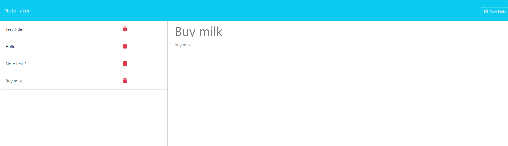

# Express-note-taker

## Description 

Note Taker is a comprehensive application designed to help users efficiently manage their ideas and tasks. The backend is powered by Express.js, enabling seamless storage and retrieval of notes. Users can easily write, save and delete their notes, promoting better organization. Notes are stored in a JSON file, and the application is deployed on Render for easy accessibility. Note Taker offers a streamlined solution to enhance productivity and keep track of important information.

## Instalation

N/A

## Usage

To use this project, visit the deployed application via the provided link and click the "Get Started" button in the center of the homepage. This will direct you to the Notes section, where you can view the list of existing notes. To add new notes, enter the note title and note text, then click the save button. To delete notes, click the trash icon next to the note you want to remove

## Screenshot of the deployed app

## URL of the deployed app

https://express-note-taker-lx3c.onrender.com

## Credits

N/A

## Contributing

We welcome contributions to this project! To contribute, please follow these steps: 1. Fork the repository. 2. Create a new branch for your feature or bug fix. 3. Make your changes. 4. Test your changes locally. 5. Commit your changes with a clear commit message. 6. Push your changes to your fork. 7. Submit a pull request to the main repository's branch. Thank you for contributing to this project!

## License

MIT License

Copyright (c) 2024 fabricioGuac

Permission is hereby granted, free of charge, to any person obtaining a copy
of this software and associated documentation files (the "Software"), to deal
in the Software without restriction, including without limitation the rights
to use, copy, modify, merge, publish, distribute, sublicense, and/or sell
copies of the Software, and to permit persons to whom the Software is
furnished to do so, subject to the following conditions:

The above copyright notice and this permission notice shall be included in all
copies or substantial portions of the Software.

THE SOFTWARE IS PROVIDED "AS IS", WITHOUT WARRANTY OF ANY KIND, EXPRESS OR
IMPLIED, INCLUDING BUT NOT LIMITED TO THE WARRANTIES OF MERCHANTABILITY,
FITNESS FOR A PARTICULAR PURPOSE AND NONINFRINGEMENT. IN NO EVENT SHALL THE
AUTHORS OR COPYRIGHT HOLDERS BE LIABLE FOR ANY CLAIM, DAMAGES OR OTHER
LIABILITY, WHETHER IN AN ACTION OF CONTRACT, TORT OR OTHERWISE, ARISING FROM,
OUT OF OR IN CONNECTION WITH THE SOFTWARE OR THE USE OR OTHER DEALINGS IN THE
SOFTWARE.

## Questions

If you have any questions or need help with the project, feel free to contact me through the following channels: - Connect with me on GitHub at [fabricioGuac](https://github.com/fabricioGuac)  - Drop me an email at [guacutofabricio@gmail.com](https://github.com/guacutofabricio@gmail.com)   Don't hesitate to reach out if you need any clarifications or want to share feedback. I'm here to assist you!
